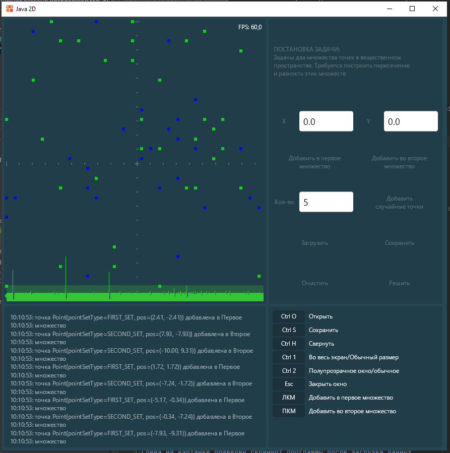
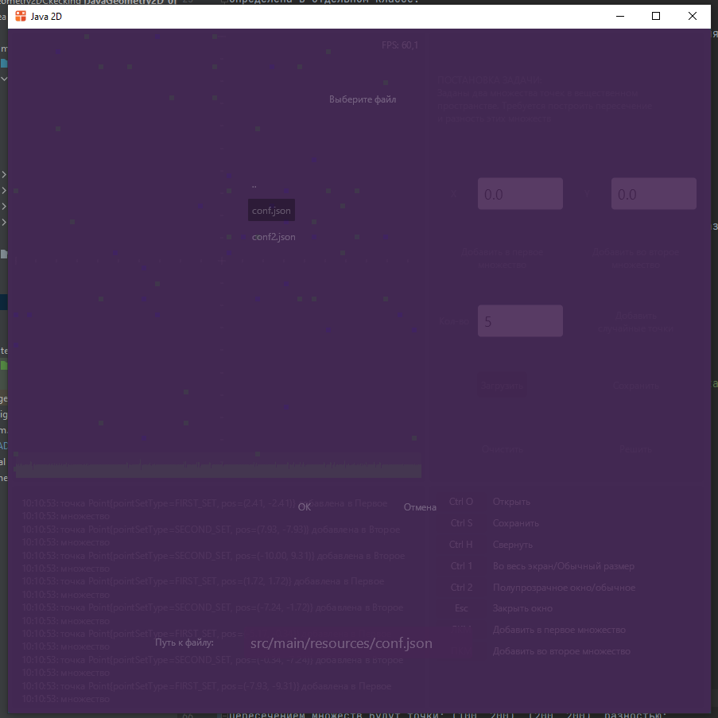
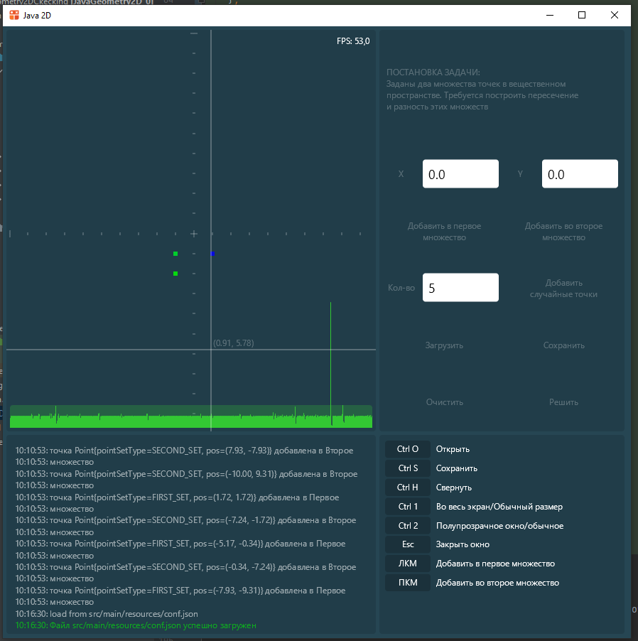
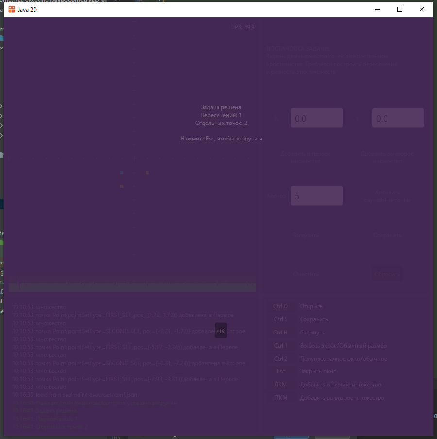

# Библиотека элементов управления Skija

В этом репозитории размещён пример графического приложения на `Java`.


Приложение решает следующую задачу:

> Заданы два множества точек в вещественном двумерном пространстве.
> Требуется построить пересечение и разность этих множеств.


Используемые технологии: `JWM`, `Skija` и `json`. Подробное объяснение кода находится
[здесь](https://ege.buran.center/docs/project/java2dGeom/intro).



Репозиторий JWM находится [здесь](https://github.com/HumbleUI/JWM).
Она использует Skija библиотеку для 2D рисования, её репозиторий
[здесь](https://github.com/JetBrains/skija).

В пакете `app` размещены все основные классы. 
Главный класс - это `app.Application`. Он рисует панели, каждая из которых
определена в отдельном классе.

В пакете `panels` определены классы панелей, `controls` - элементы управления.
Диалоговые окна расширяют класс панели, находятся в пакете `dialogs`. 
В пакете `misc` лежат вспомогательные классы.


## Функционал программы

- добавление точек вручную кликом мыши и с помощью полей ввода.
- добавление заданного количества случайных точек
- сохранение текущего набора точек в файл и загрузка из него
- графическое решение задачи (окраска точек определяется принадлежность к разности или
  пересечению исходных множеств)

Для сохранения и загрузки точек вызывается диалог:




Все файлы хранятся в папке `resources`. Путь к файлу можно вводить вручную.
На панели находится всего одно поле ввода, поэтому фокус зафиксирован на нём. 


## Демо-файл

В демонстрационном файле `conf.json` определено шесть точек. Программа
читает файл построчно, пока не дойдёт до его конца. Две точки содержатся
в первом множестве: (-1.0, 1.0), (1.0, 1.0), и две во втором:
(-1.0, 1.0), (-1.0, 2.0)

```json
{
  "@class": "app.Task",
  "ownCS": {
    "min": {
      "x": -10.0,
      "y": -10.0
    },
    "max": {
      "x": 10.0,
      "y": 10.0
    }
  },
  "points": [
    {
      "pos": {
        "x": -1.0,
        "y": 1.0
      },
      "setType": "FIRST_SET"
    },
    {
      "pos": {
        "x": 1.0,
        "y": 1.0
      },
      "setType": "FIRST_SET"
    },
    {
      "pos": {
        "x": -1.0,
        "y": 1.0
      },
      "setType": "SECOND_SET"
    },
    {
      "pos": {
        "x": -1.0,
        "y": 2.0
      },
      "setType": "SECOND_SET"
    }
  ]
}
```

Пересечением множеств будет точка: (-1.0, 1.0), разность образована двумя точками:
(1.0, 1.0) и (-1.0, 2.0)

Если загрузить файл `conf.json`, то загрузится
рассматриваемый пример



Если нажать кнопку решить, то появится диалоговое
окно с решением



Если нажать `Esc`, то окно закроется и решение
отобразится в рабочей области


